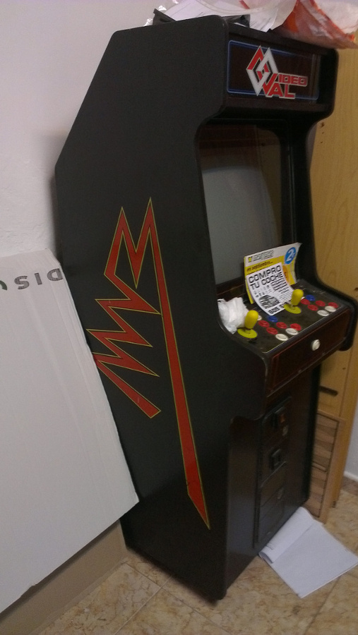
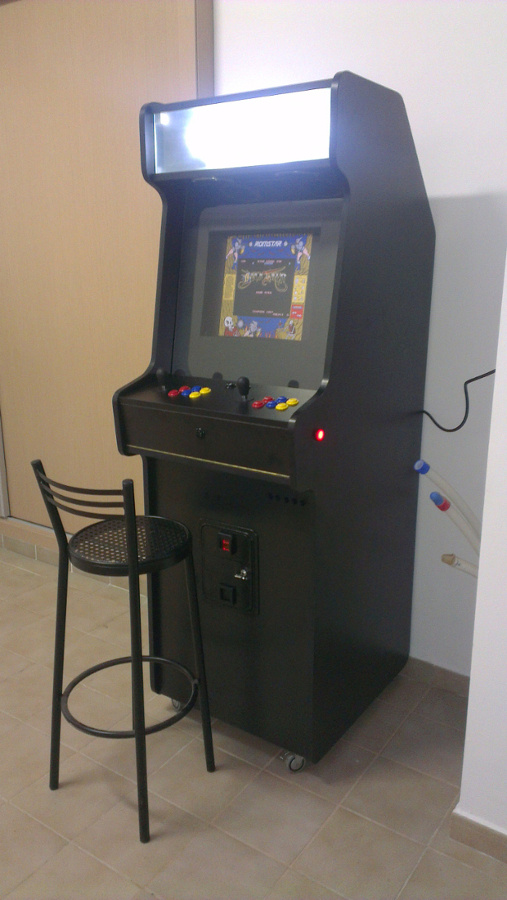

# Construcción de máquina recreativa - Introducción

Esta recreativa está basada en una VideoVal, ésta la conseguimos entre tres amigos, pero ante la imposibilidad de quedar para arreglarla, decidí hacerme yo una desde cero.

De esta máquina hice una plantilla del lateral con cartón y a partir de la plantilla obtuve las medidas y la forma.

He de resaltar que mi máquina es un poco más alta que la original, le di 10 cm. más de alto, ya que me parecía un poco baja la original. Aunque de pequeño recuerdo que a veces teníamos que subir a las banquetas para poder jugar bien, en ese momento parecían muy altas.

