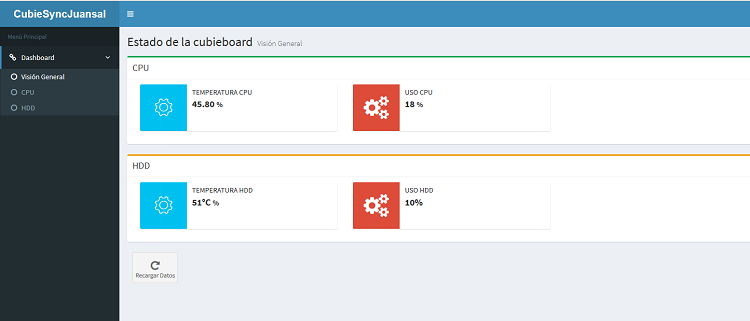
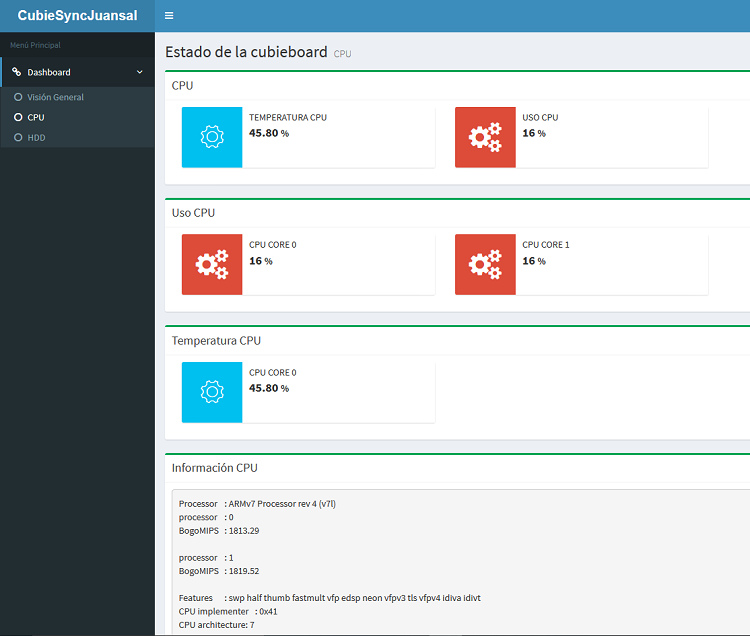
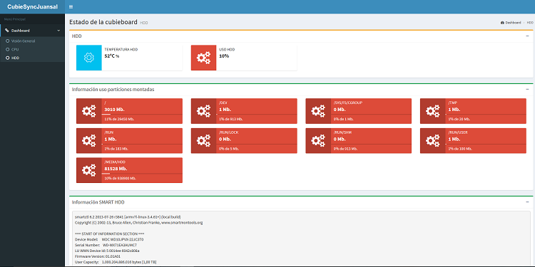

# Monitor basado en AngularJs y NodeJs para la Cubietruck (Cubieboard 3)

## Finalidad del artículo

La finalidad de este artículo es mostrar de forma gráfica e intuitiva la información mostrada en el [anterior artículo sobre la Cubietruck](../2015/web_con_informacion_sobre_temperatura_y_discos_duros_en_la_cubietruck_cubieboard_3.md).  
Para ello he creado una web con AngularJS atacando a servicios REST hechos con NodeJS. Para mejorar la parte gráfica he utilizado una plantilla web gratuita llamada [AdminLTE](https://almsaeedstudio.com/themes/AdminLTE/index2.html).  
El desarrollo de la página y de los servicios REST los he realizado utilizando la [máquina virtual](../2016/maquina_virtual_de_desarrollo_para_proyectos_de_angularjs_y_nodejs.md) que he creado para tal efecto.

## Software instalado en la Cubieboard

### Git

Este es el cliente usado para descargar la web desde github.  
Para la instalación he ejecutado los siguientes comandos:

``` bash
apt-get install git
```

### NodeJS

Para la instalación de [NodeJS](https://nodejs.org/) he elegido la última versión (en el momento de escribir el artículo es la 6.x) y he ejecutado los siguientes comandos:

``` bash
curl -sL https://deb.nodesource.com/setup_6.x | sudo -E bash -
sudo apt-get install -y nodejs
```

#### Información adicional

[Installing Node.js via package manager](https://nodejs.org/en/download/package-manager/#debian-and-ubuntu-based-linux-distributions)

## Librerías adicionales que he instalado en la Cubieboard para poder realizar la monitorización

### lm-sensors

Para poder detectar la temperatura de la CPU he usado la herramienta [lm-sensors](http://www.lm-sensors.org).  
Los pasos que he seguido para instalarla han sido los siguientes:

Primero he ejecutado el siguiente comando para instalarla:

``` bash
sudo apt-get install lm-sensors
```

Una vez instalada he ejecutado los siguientes comandos para configurarla y arrancarla:

``` bash
sudo sensors-detect
sudo service kmod start
```

#### Información adicional

[lm-sensors](http://www.lm-sensors.org)  
[Repositorio Github](https://github.com/groeck/lm-sensors)  
[How do I get the CPU temperature?](http://askubuntu.com/questions/15832/how-do-i-get-the-cpu-temperature)

## Software adicional instalado en la máquina de desarrollo

### less

Como requerimiento de la plantilla usada para generar la web se necesita el preprocesador de css [less](http://lesscss.org/).  
Para instalarlo he ejecutado los siguientes comandos:

``` bash
sudo npm install -g less
```

## Proceso de creación de la web en la máquina virtual de desarrollo

### Preparación de la plantilla

Para esta web he utilizado una plantilla gratuita llamada [AdminLTE](https://almsaeedstudio.com/themes/AdminLTE/index2.html) de la página de [Almsaeed Studio](https://almsaeedstudio.com/).  
La he descargado desde la página principal pulsando sobre el link [Download](https://almsaeedstudio.com/download/AdminLTE-master), la versión en el momento en que descargué la plantilla era la 2.3.3.
La he descomprimido en `$HOME` y copiado al directorio `cubieboard-monitor`, de esta forma siempre tengo una copia completa de la plantilla para poder consultarla.  
Los comandos ejecutados han sido los siguientes:

``` bash
cd
unzip ~/Descargas/AdminLTE-2.3.3.zip
cp -R AdminLTE-2.3.3 cubieboard-monitor
```

Una vez realizados los pasos anteriores creo en github un repositorio llamado [cubieboard-monitor](https://github.com/juaalta/cubieboard-monitor) y preparo la carpeta local para atacar a este repositorio.  
Los comandos ejecutados han sido los siguientes:

``` bash
git config --global user.email "correo"
git config --global user.name "usuario"

git init
git add .
git commit -m "Commit inicial"
git remote add origin https://github.com/juaalta/cubieboard-monitor.git
git remote -v
git add .
git push -u origin master
```

Después de los pasos anteriores ejecuto la instalación de dependencias por parte de NodeJS, mediante el siguiente comando:

``` bash
npm install
```

### Creación de los servicios REST

Para la creación de los servicios REST he usado NodeJS, por su capacidad para ejecutar comandos de shell de Linux. Todo el código se concentra dentro del fichero `server.js`.  
Los servicios que allí se encuentran están están nombrados, dependiendo para que parte del sistema monitorizan, estas partes (en el momento de redacción del documento v.1.1.0) son las siguientes:

* Servicios que empiezan por **HDD**: estos servicios se encargan de obtener la información sobre los discos duros y sus particiones.
* Servicios que empiezan por **CPU**: estos servicios se encargan de obtener la información sobre la CPU y sus cores.
* Servicios que empiezan por **SYS**: estos servicios se encargan de obtener información sobre el sistema.

Cada servicio llama a un script cuyo nombre es el mismo que el del servicio. Estos scripts se encuentran dentro de la carpeta `scripts` de la web.

### Diseño e implementación de la web

Basándome en la plantilla instalada, he creado 3 secciones para la web, estas son:

* Visión General: en esta sección se encuentra información general sobre el estado de la Cubieboard.
* CPU: en esta sección se encuentra toda la información sobre el estado de la CPU.
* HDD: en esta sección se encuentra toda la información sobre el estado de los discos duros y sus particiones.







## Instalación en la Cubieboard

Los pasos para instalar el proyecto en la Cubieboard son los siguientes:

* Configurar git, sólo la primera vez:

``` bash
git config --global user.email "correo"
git config --global user.name "usuario"
```

* Bajar el proyecto desde github a la carpeta `~/cubieboard-monitor`:

``` bash
cd
git clone https://github.com/juaalta/cubieboard-monitor.git cubieboard-monitor
```

* Entrar en la carpeta en la que se ha descargado e instalar las dependencias necesarias:

``` bash
cd cubieboard-monitor

npm install

```

Una vez seguidos los pasos anteriores, si queremos probar la aplicación sólo tenemos que lanzar el siguiente comando:

``` bash
nodejs server.js
```

También puede ejecutarse:

``` bash
npm start
```

## Arranque automático

Para que la web arranque de forma automática al arrancar/reiniciar la cubieboard he seguido los siguientes pasos:

Primero he creado un script que se encargue de arrancar la web, el script se llama `/usr/local/bin/cubieboardMonitor.sh` y su contenido es:

``` bash
#! /bin/sh

cd /root/cubieboard-monitor
nodejs server.js &

```

Después de esto le he dado permisos de ejecución, ejecutando el siguiente comando:

``` bash
chmod +x /usr/local/bin/cubieboardMonitor.sh
```

Después he creado el script de arranque como servicio, para esto he creado una copia de un script plantilla dentro de la carpeta `/etc/init.d`. Para esto he ejecutado el siguiente comando:

```bash
cp /etc/init.d/skeleton /etc/init.d/cubieboardMonitor
```

Después he modificado su contenido para que arranque el script anterior, quedando de la siguiente forma:

``` bash
#! /bin/sh
### BEGIN INIT INFO
# Provides:          skeleton
# Required-Start:    $remote_fs $syslog
# Required-Stop:     $remote_fs $syslog
# Default-Start:     2 3 4 5
# Default-Stop:      0 1 6
# Short-Description: Example initscript
# Description:       This file should be used to construct scripts to be
#                    placed in /etc/init.d.
### END INIT INFO

# Author: Foo Bar <foobar@baz.org>
#
# Please remove the "Author" lines above and replace them
# with your own name if you copy and modify this script.

# Do NOT "set -e"

# PATH should only include /usr/* if it runs after the mountnfs.sh script
PATH=/sbin:/usr/sbin:/bin:/usr/bin
DESC="Monitor de la cubieboard"
NAME=cubieboardMonitor
DAEMON=/usr/local/bin/cubieboardMonitor.sh
DAEMON_ARGS=""
PIDFILE=/var/run/$NAME.pid
SCRIPTNAME=/etc/init.d/$NAME

# Exit if the package is not installed
[ -x "$DAEMON" ] || exit 0

# Read configuration variable file if it is present
[ -r /etc/default/$NAME ] && . /etc/default/$NAME

# Load the VERBOSE setting and other rcS variables
. /lib/init/vars.sh

# Define LSB log_* functions.
# Depend on lsb-base (>= 3.2-14) to ensure that this file is present
# and status_of_proc is working.
. /lib/lsb/init-functions

#
# Function that starts the daemon/service
#
do_start()
{
        # Return
        #   0 if daemon has been started
        #   1 if daemon was already running
        #   2 if daemon could not be started
        start-stop-daemon --start --quiet --pidfile $PIDFILE --exec $DAEMON --test > /dev/null \
                || return 1
        start-stop-daemon --start --quiet --pidfile $PIDFILE --exec $DAEMON -- \
                $DAEMON_ARGS \
                || return 2
        # Add code here, if necessary, that waits for the process to be ready
        # to handle requests from services started subsequently which depend
        # on this one.  As a last resort, sleep for some time.
}

#
# Function that stops the daemon/service
#
do_stop()
{
        # Return
        #   0 if daemon has been stopped
        #   1 if daemon was already stopped
        #   2 if daemon could not be stopped
        #   other if a failure occurred
        start-stop-daemon --stop --quiet --retry=TERM/30/KILL/5 --pidfile $PIDFILE --name $NAME
        RETVAL="$?"
        [ "$RETVAL" = 2 ] && return 2
        # Wait for children to finish too if this is a daemon that forks
        # and if the daemon is only ever run from this initscript.
        # If the above conditions are not satisfied then add some other code
        # that waits for the process to drop all resources that could be
        # needed by services started subsequently.  A last resort is to
        # sleep for some time.
        start-stop-daemon --stop --quiet --oknodo --retry=0/30/KILL/5 --exec $DAEMON
        [ "$?" = 2 ] && return 2
        # Many daemons don't delete their pidfiles when they exit.
        rm -f $PIDFILE
        return "$RETVAL"
}

#
# Function that sends a SIGHUP to the daemon/service
#
do_reload() {
        #
        # If the daemon can reload its configuration without
        # restarting (for example, when it is sent a SIGHUP),
        # then implement that here.
        #
        start-stop-daemon --stop --signal 1 --quiet --pidfile $PIDFILE --name $NAME
        return 0
}

case "$1" in
  start)
        [ "$VERBOSE" != no ] && log_daemon_msg "Starting $DESC" "$NAME"
        do_start
        case "$?" in
                0|1) [ "$VERBOSE" != no ] && log_end_msg 0 ;;
                2) [ "$VERBOSE" != no ] && log_end_msg 1 ;;
        esac
        ;;
  stop)
        [ "$VERBOSE" != no ] && log_daemon_msg "Stopping $DESC" "$NAME"
        do_stop
        case "$?" in
                0|1) [ "$VERBOSE" != no ] && log_end_msg 0 ;;
                2) [ "$VERBOSE" != no ] && log_end_msg 1 ;;
        esac
        ;;
  status)
        status_of_proc "$DAEMON" "$NAME" && exit 0 || exit $?
        ;;
  #reload|force-reload)
        #
        # If do_reload() is not implemented then leave this commented out
        # and leave 'force-reload' as an alias for 'restart'.
        #
        #log_daemon_msg "Reloading $DESC" "$NAME"
        #do_reload
        #log_end_msg $?
        #;;
  restart|force-reload)
        #
        # If the "reload" option is implemented then remove the
        # 'force-reload' alias
        #
        log_daemon_msg "Restarting $DESC" "$NAME"
        do_stop
        case "$?" in
          0|1)
                do_start
                case "$?" in
                        0) log_end_msg 0 ;;
                        1) log_end_msg 1 ;; # Old process is still running
                        *) log_end_msg 1 ;; # Failed to start
                esac
                ;;
          *)
                # Failed to stop
                log_end_msg 1
                ;;
        esac
        ;;
  *)
        #echo "Usage: $SCRIPTNAME {start|stop|restart|reload|force-reload}" >&2
        echo "Usage: $SCRIPTNAME {start|stop|status|restart|force-reload}" >&2
        exit 3
        ;;
esac

:

```

Después de modificarlo le he dado permisos de ejecución:

``` bash
chmod +x /etc/init.d/cubieboardMonitor
```

Para que este script arranque como demonio se ha de ejecutar el siguiente comando:

``` bash
update-rc.d cubieboardMonitor defaults
```


## Links con información adicional y complementaria

Para la creación de este proyecto me he basado en la información publicada en este artículo: [Tutorial de AngularJS. Ejemplo de aplicación web conectada a una API REST con Node](https://carlosazaustre.es/blog/tutorial-ejemplo-de-aplicacion-web-con-angular-js-y-api-rest-con-node/)


### Links con información y descarga del tema AdminLTE

[Almsaeed Studio](https://almsaeedstudio.com/)  
[Documentación](https://almsaeedstudio.com/themes/AdminLTE/documentation/index.html)  
[Preview](https://almsaeedstudio.com/themes/AdminLTE/index2.html)  
[Repositorio de github](https://github.com/almasaeed2010/AdminLTE)

### Páginas con temas para AngularJS

[Start Angular](http://startangular.com/)  
[20 Free Bootstrap 3 Admin Dashboard Templates For Your Web App 2016](https://colorlib.com/wp/free-bootstrap-admin-dashboard-templates/)  
[15 Best Responsive HTML5 & CSS3 AngularJS Admin Templates To Build Awesome Web Apps 2016](https://colorlib.com/wp/angularjs-admin-templates/)
