# Material density detection system used to create wet wipes with Arduino 1/2

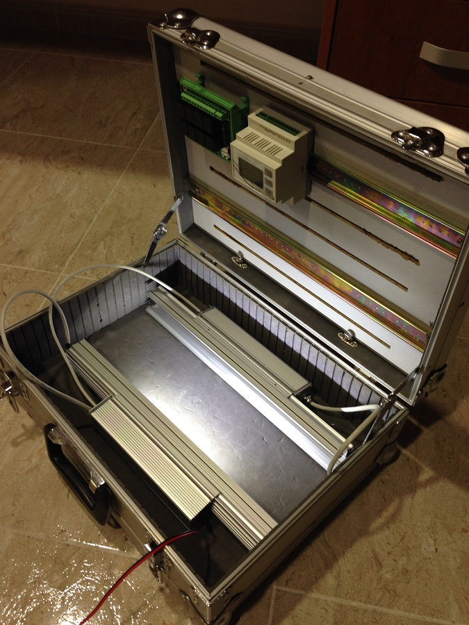

## Introduction

This adventure began when my friend Fran came to find me to tell me the need he had detected in a company and wanted me to lend a hand to get it to good port.
Although in the end the project was not implemented in the company, we decided to finish it, we had spent too much time in it not to do it.

The project was to create a system to detect the density of a material to detect if it met the expected quality.
In case of failure to comply, a relay must be activated.
The solution that was chosen had to be applied to 9 machines, to be able to be working 24 hours a day and to perform the tasks at the speed of operation of the machine.

The product to be analyzed consisted of the reels of material used to create the wet wipes.

The cases that had to produce the activation of the relay were the following:

- Product density less than expected.
- Product density higher than expected.
- Binding tapes on the product.
- Breakage and deformation of the product.

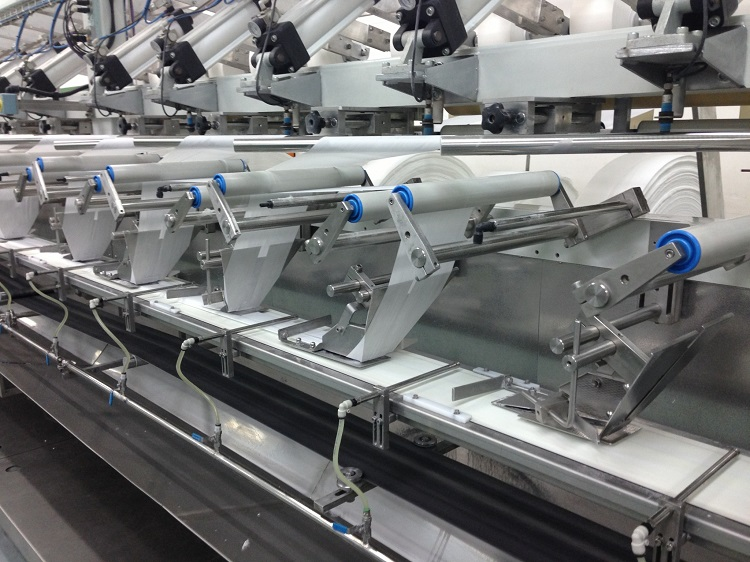

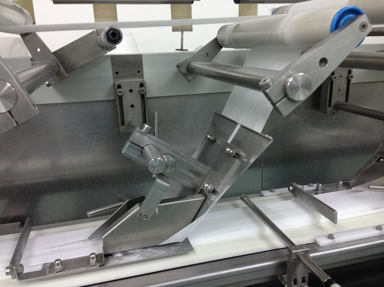

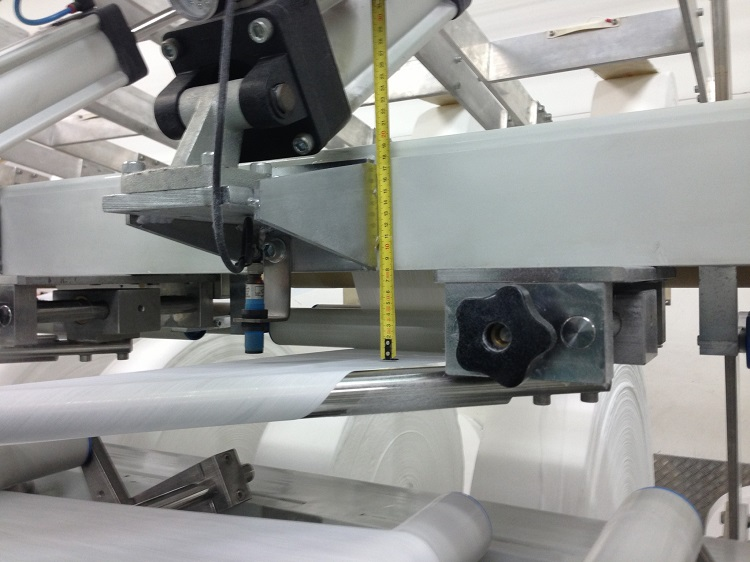

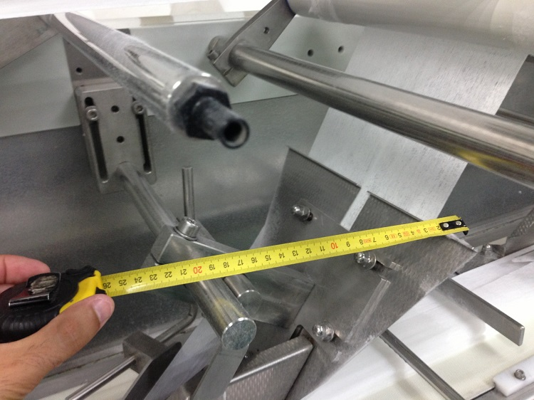

To address the problem it was decided to create several brainstorming sessions and information search to try to find the best solutions to this problem.
The ideas that occurred to us and that were studied as possible solutions to the problem, in order, are the following:

### Using a camera and study the product from the information received.

The idea was, from the information obtained from a camera that was pointing directly to the product, using an image analysis software to detect each of the cases described above.

The detection of joints, breaks and deformations consisted of using artificial vision libraries such as [OpenCV](http://opencv.org/) or [SimpleCV](http://simplecv.org/) to analyze the received images , and from certain rules to obtain if these cases were fulfilled.
The measurement of the density of the product should be made by analyzing the color of the product when it is crossed by a light, with a color to study.

This idea was discarded by the high cost of hardware needed to do it, in addition to the complexity of the software to be created.

### Illuminate with infrared light and analyzing light passing through the product.

The idea was, with an infrared light to illuminate the product and analyze the temperature of the light through this one.
The best way to perform the measurements was studied for a time, but any changes in the temperature or light intensity of the room in which the machines were found affected the measurements.

It was discarded because the temperature of the product can change due to external effects and beyond our control, therefore, it complicated the measurement of this temperature greatly and forced the system to detect changes of temperature and light intensity in the room and forced that the system will calibrate itself by detecting a minimum change of one of these two parameters.

### Illuminate with normal light and analyze the amount of light that passes through the product.

This was the idea that was put into practice.

The idea was to illuminate the product on one side and the opposite measure the amount of light that passed through.

After studying what color to use it was decided to use white, this was the best information could be obtained and the least affected by having to pass through the product.

This system could detect the 4 cases that the system had to comply with:

- **Product density lower than expected:** It would be detected if the light intensity was higher than an upper limit value of light intensity.
- **Product density higher than expected:** It would be detected if the light intensity was less than a lower limit value of light intensity.
- **Bonding tapes on the product:** It would be detected if the light intensity was zero or almost null.
- **Product breakages and deformations:** It would be detected if the light intensity was the maximum possible or near maximum.

## Iterations / Phases through which the project passed to reach the final solution.

After deciding how to solve the problem, he decided how to put it into practice.
The conclusion reached was as follows:

- They had to create 2 bars that should be aligned and the product should pass between them.
- One bar should illuminate the product evenly and the other should be the LDR's (Light Dependent Resistor) to analyze the amount of light that passes through it.
- To control both bars would use an Arduino. It was decided to use the Arduino Pro Mini because of its small size.
- To activate the relays and send the configuration parameters to the Arduinos that handled the bars would use another Arduino. We searched the internet for one that could be used in an electrical panel or a carcass for the same one that fulfilled the same purpose and we found the [Industruino](https://Industruino.com/).
- The communication between the Arduinos of the bars and the Industruino would be realized by the bus I2C.

From the solution that was decided to follow was created 3 iterations. Each of the iterations generated a different prototype and brought us closer to the final solution of the problem.

In order to carry out the tests, it was necessary to use the ingenuity of my brother Raúl, who built us a bank to be able to carry out the tests, this one was modified according to the necessities in each one of the tests that were realized.

### Iteration 1

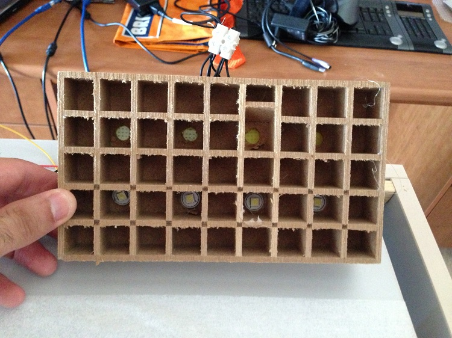

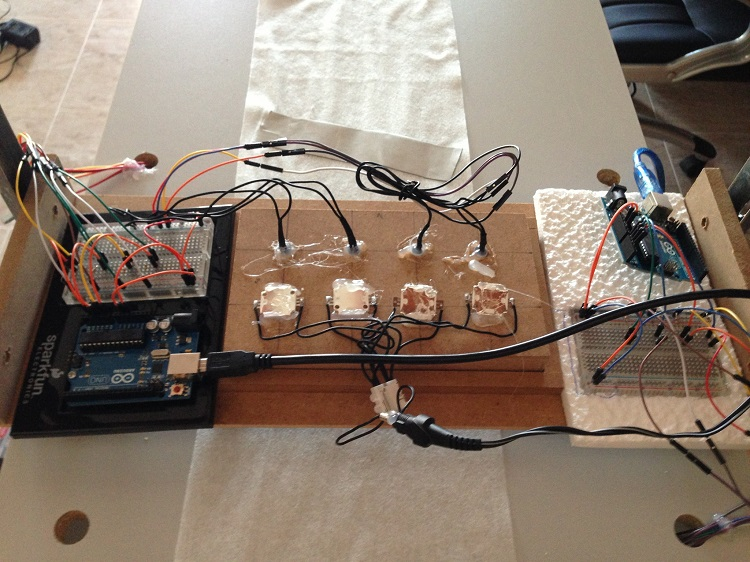

In this iteration was considered to create 1 matrix of holes of 5x9 squares, in which an LED would be introduced, but taking into account that the LEDs could not be placed in consecutive holes. In this way we avoided that the light of an LED would affect a LDR that was not its own, in addition to trying to prevent the ambient light from affecting the light measurements performed by the LDR.

First, it started with LED bulbs, but it was not possible to get enough light to make the measurements correctly and efficiently.
We continued with some car headlight LEDs, but the result was the same as with previous LEDs.
We continued the search for LEDs that were powerful enough to take the measurements correctly and we found some 10w, they made a lot of light and had to regulate its intensity, the amount of light they emitted at maximum power was so great which traversed the product and the measurements were close to the maximum light that LDRs could measure.

As last test was placed a row of 10w LEDs and a row of car LEDs. After the test was concluded that the LEDs to be used were 10w, but with their intensity regulated. These bars were able to meet all the detection objectives, but their size was too large and therefore discarded.

### Iteration 2

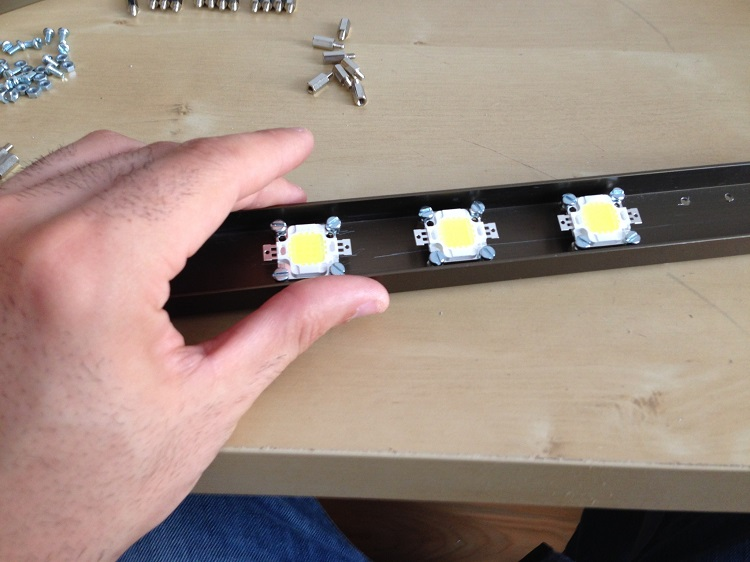

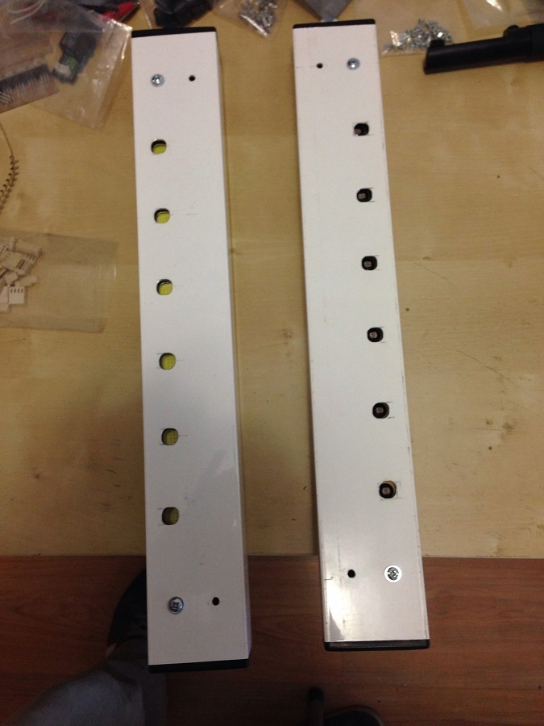

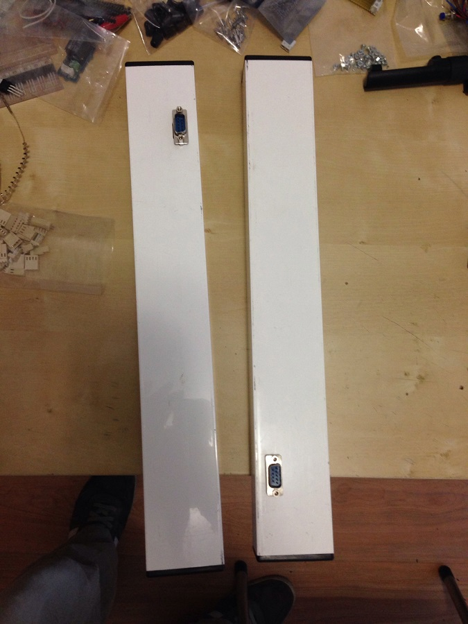

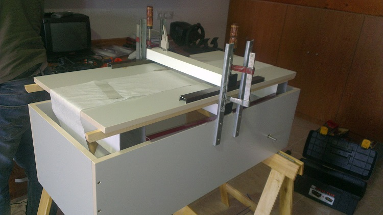

In this iteration rectangular aluminum bars were used, which allowed the bars to be thinner than those designed with wood in the previous iteration.

To avoid that some LEDs did not affect the others and the LDR were not affected by the light of the other LEDs were all withdrawn a little towards the interior of the bar of LEDs, in this way it was avoided that the non-direct light received by the LDRs of the LDRs bar will affect the measurements.

In this iteration one had the problem that each of the LEDs emitted a slightly different intensity of light and in some cases a slightly different color, this complicated the code enough, since this forced that the LEDs and the LDRs had to be calibrated in an independent way. In addition to the above, it was found that the bars were still a little large for the available space.

### Iteration 3

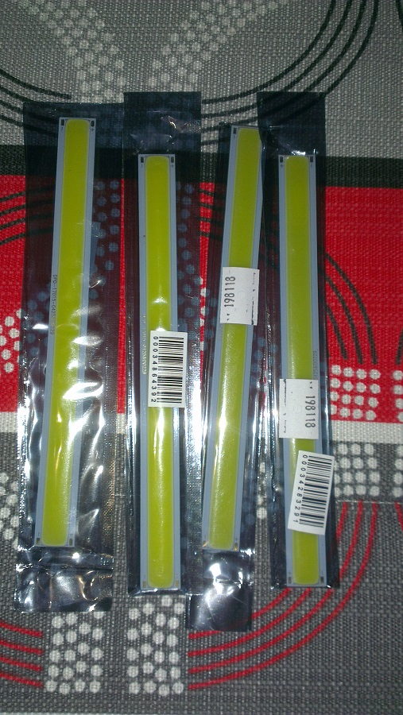

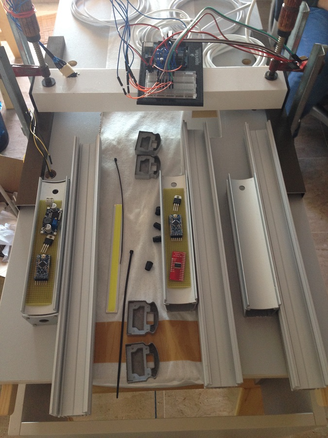

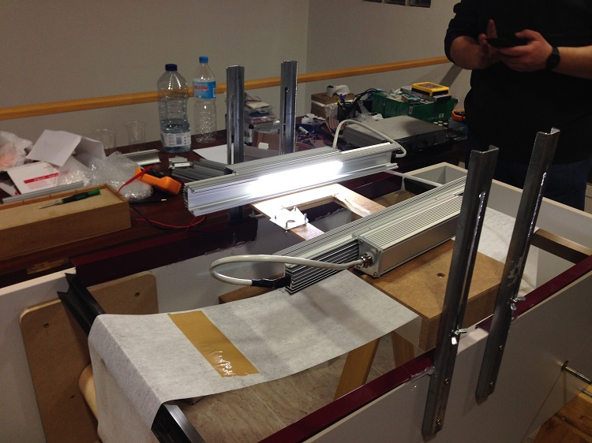

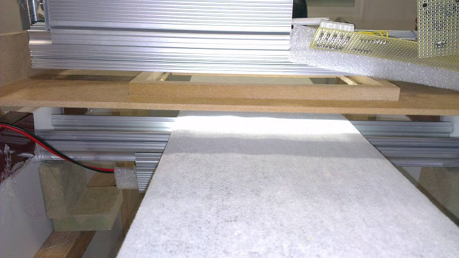

The beginning of this iteration began with the search for smaller bars and that allowed to reduce the total size of the bars, of this form to be able to use them in the final solution. As a result of this search were found profiles used for outdoor lighting that allowed us to have the desired size for the bars, in addition to a rather large capacity of heat dissipation, 10w LEDs emitted a fairly high amount of heat.
During the search process of the previous bars and by chance were found rectangular LED 6W COB 170 x 15 mm, which allowed to illuminate all the product of uniform form, of this form it avoided to have to hide the LDR so that the light of a different LED than the one assigned will affect the measurement of this one. This allowed all previous LEDs to be replaced with only one COB.

The finding of these LEDs also made it possible to simplify the calibration process, since from then only the measurements to be taken by each of the LDRs had to be calibrated and the calibration of the LED was unnecessary since only one COB LED was needed. In addition to this, it simplified the circuit necessary for the control of the bars, this allowed that this circuit could be placed in the same bars and did not have to place it in a box outside these.

During this phase was a mishap and an error in the connection of a power supply, connected to the Industruino in an unregulated input a voltage higher than the one supported and it was burned, being unusable, therefore, it was decided to create a similar assembly to Industruino, but with an Arduino UNO, a LCD 16x2 and 3 buttons, this way could be finished this phase.
