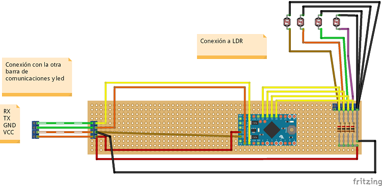
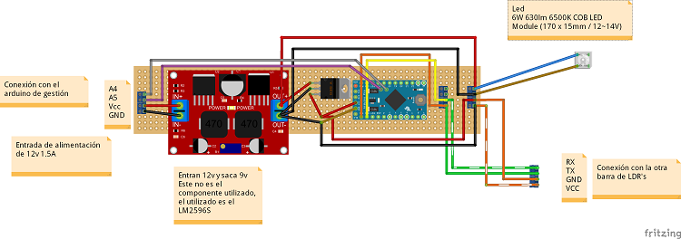
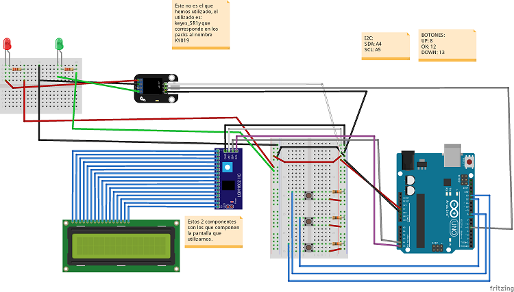
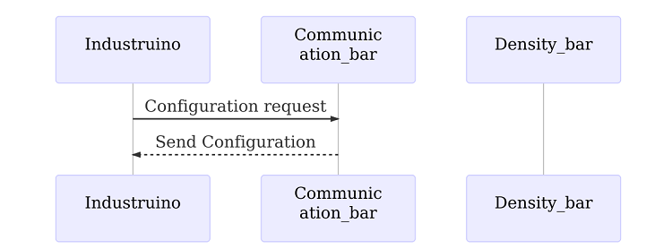
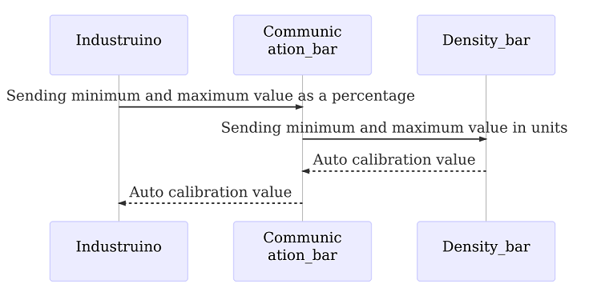
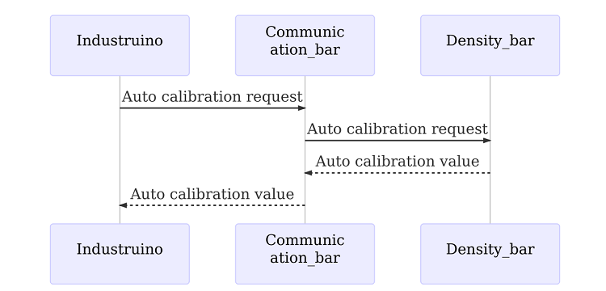
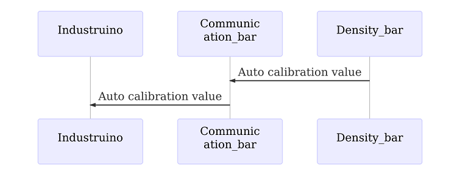
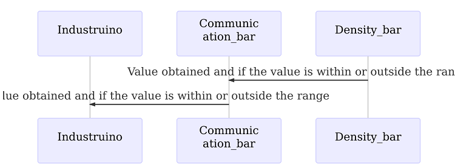

# Material density detection system used to create wet wipes with Arduino 2/2

## Construction of the final prototype

### Components used

The components used have been, per module:

- Density Bar
    - 1 - [Arduino Pro Mini 5v](http://www.ebay.es/itm/311064700128?_trksid=p2060353.m2749.l2649&ssPageName=STRK%3AMEBIDX%3AIT)
    - 4 - [LDRs](http://www.aliexpress.com/item/10PCS-LOT-10W-900-1000LM-LED-Bulb-IC-SMD-Lamp-Light-Daylight-white-High-Power-LED/892676886.html)
    - 4 - Resistors 1k
    - 2 - [PCB Terminal Blocks](http://www.ebay.es/itm/20pcs-2Pin-Plug-in-Screw-Terminal-Block-Connector-5-08mm-Pitch-Through-Hole-OT8G-/221790619454?hash=item33a3c0473e:g:GN4AAOSw3xJVbchf)

- Communication bar
    - 1 - [Arduino Pro Mini 5v](http://www.ebay.es/itm/310562519074?_trksid=p2060353.m2749.l2649&ssPageName=STRK%3AMEBIDX%3AIT)
    - 1 - [LM2596s DC-DC step down power supply module](http://www.aliexpress.com/item/10pcslot-LM2596s-DC-DC-step-down-power-supply-module-3A-adjustable-step-down-module-LM2596-voltage/1289330336.html)
    - 2 - [PCB Terminal Blocks](http://www.ebay.es/itm/20pcs-2Pin-Plug-in-Screw-Terminal-Block-Connector-5-08mm-Pitch-Through-Hole-OT8G-/221790619454?hash=item33a3c0473e:g:GN4AAOSw3xJVbchf)
    - 1 - [Voltage regulator TIP220](https://es.aliexpress.com/item/Free-Shopping-100PCS-TIP122-TO-220-NPN-100V-5A-Silicon-Transistors/982804378.html)
	- 1 - [Heat Sink for TIP220](http://www.ebay.es/itm/10x-Aluminum-Heatsink-Heat-Sink-with-Screw-Sets-for-TO-220-Transistor-20x15x10mm-/331644225334?hash=item4d37894736:g:pBcAAOSw3ydV5uq7)
    - 1 - [Rectangular LED 6W 630lm 6500K COB 170 x 15 mm.](http://www.dx.com/p/6w-630lm-6500k-cob-LED-module-170-x-15mm-12-14v-198118)

- Industruino
    - 1 - [Industruino PROTO kit](https://Industruino.com/)
	- 1 - [Relay module Keyes_SR1](http://www.dx.com/p/arduino-5v-relay-module-blue-black-121354)

- Arduino with screen
    - 1 - [Arduino UNO R3](https://store.arduino.cc/product/A000066)
	- 1 - [16x2 Character LCD module with I2C](http://www.ebay.es/itm/Blue-Display-IIC-I2C-TWI-SP-I-Serial-Interface-1602-16X2-Character-LCD-Module-/162009210885?hash=item25b8806005:g:nsEAAOSw32lYpp16)
	- 3 - Resistors 10k
	- 2 - Resistors 220
	- 1 - LED Red
	- 1 - LED Green
	- 3 - [Buttons](https://www.wish.com/c/5327c1b207aab40f27aecc1e)
	- 1 - [Relay module Keyes_SR1](http://www.dx.com/p/arduino-5v-relay-module-blue-black-121354)


### Assembly of the circuit

The Fritzing scheme is as follows:

- Density bar



This circuit is responsible for obtaining the measurements and send notifications to the communications bar for redirection.

- Communication bar



This circuit is responsible for the communications of the density bar, in addition to the power supply of the bar and all the components it contains.

- Arduino with screen



This assembly is the one made to replace the burned Industruino.

### Software: Functionality to be implemented and protocol design used

This section discusses the functionality of the software created and the messaging protocol that has been designed so that the communication meets the desired functionality.

The functionality of the implemented software is as follows:

* Auto calibration of light sensors. This step must be performed automatically when the density bar is started or when the user asks for it.
* From an average value of light that is considered as valid (the quality of the product is correct) you must indicate a higher percentage and a lower percentage, within which the product is considered to contain the desired quality. The valid value is obtained from the auto calibration.
* From the data of the 2 previous points send a signal if the product is not within the desired quality.

Each of the bars is responsible for one or several features and the Industruino (and later the Arduino with screen) of others, these are:

* Industruino / Arduino  with screen:
 - Configuration of the percentages to apply to the average value of quality.
 - Activate the warning signal if you receive notification that a piece has been found that does not meet the quality.
 - Density bar configuration request.
* Density bar
 - Auto calibration execution, either at startup or when prompted.
 - Perform measurements and advise if any is out of range.
* Communication bar
 - Intermediate between the density bar and the Industruino, within this role is responsible for:
   - Convert the percentages passed by the Industruino to values within the measuring range and communicate them to the density bar.
   - Ask the density bar the values required by the Industruino and transform them if necessary.
   - Filtering the ads from the density bar to the Industruino only alerts the Industruino if there has been a change.

For communication between the bars, the following messaging protocol was designed:

* Requests from the Industruino
 1. Request current bar configuration.

 2. Configuration data for the bar (data modified in Industruino and sent to the bars).

 3. Auto calibration request bar.

* Shipments to the Industruino, independent of the previous ones in response to a request of this one
 1. Sending information auto calibrated (the first start of the bar always performs a self calibration without being prompted by the Industruino)

 2. Sending data about the readings. It is only sent when there is a change between in or out of range.



### Libraries used in each Arduino:

This section lists each of the libraries that have been created and those that have been used for each of the Arduinos that compose the project.

#### Density bar

* [EasyTransfer](http://www.billporter.info/easytransfer-Arduino-library/): library used for communications between bars.
* Internal libraries: created by us and used to make programming easier.
 * CommunicationStructures.h: used to contain the data structures that were sent between Arduinos.
 * EEPROMAnything.h: used to manage data stored in the EEPROM. Retrieved from the following URL: http://playground.Arduino.cc/Code/EEPROMWriteAnything
 * I2C_Anything.h: Used for read and write management over the I2C port. Retrieved from the following URL: http://forum.Arduino.cc/index.php?topic=104732.0.

#### Communication bar

* Wire: library used for I2C connections.
* [EasyTransfer](http://www.billporter.info/easytransfer-Arduino-library/): library used for communications between bars.
* Internal libraries: created by us and used to make programming easier.
 * CommunicationStructures.h: used to contain the data structures that were sent between Arduinos.
 * EEPROMAnything.h: used to manage data stored in the EEPROM. Retrieved from the following URL: http://playground.Arduino.cc/Code/EEPROMWriteAnything
 * I2C_Anything.h: Used for read and write management over the I2C port. Retrieved from the following URL: http://forum.Arduino.cc/index.php?topic=104732.0.

#### Industruino

* U8glib: library used to paint on the screen of the Industruino. Retrieved from the following URL: https://github.com/olikraus/u8glib
* M2tklib: library used to paint the menus on the screen of the Industruino. Retrieved from the following URL: https://github.com/olikraus/m2tklib
* Wire: library used for I2C connections.
* [EasyTransfer](http://www.billporter.info/easytransfer-Arduino-library/): library used for communications between bars.
* Internal libraries: created by us and used to make programming easier.
 * CommunicationStructures.h: used to contain the data structures that were sent between Arduinos.
 * EEPROMAnything.h: used to manage data stored in the EEPROM. Retrieved from the following URL: http://playground.Arduino.cc/Code/EEPROMWriteAnything
 * I2C_Anything.h: Used for read and write management over the I2C port. Retrieved from the following URL: http://forum.Arduino.cc/index.php?topic=104732.0.

#### Arduino with screen

* LiquidCrystal: library used to paint on the screen of the Arduino. Retrieved from the following URL: https://bitbucket.org/fmalpartida/new-liquidcrystal/downloads/
* Wire: library used for I2C connections.
* [EasyTransfer](http://www.billporter.info/easytransfer-Arduino-library/): library used for communications between bars.
* Internal libraries: created by us and used to make programming easier.
 * CommunicationStructures.h: used to contain the data structures that were sent between Arduinos.
 * EEPROMAnything.h: used to manage data stored in the EEPROM. Retrieved from the following URL: http://playground.Arduino.cc/Code/EEPROMWriteAnything
 * I2C_Anything.h: Used for read and write management over the I2C port. Retrieved from the following URL: http://forum.Arduino.cc/index.php?topic=104732.0.

### The Arduino code is as follows:

To verify the I2C address of the elements that used this protocol has been used the called program [Arduino I2c Scanner](http://todbot.com/blog/2009/11/29/i2cscanner-pde-Arduino-as-i2c-bus-scanner/).

#### Internal library

This is not an Arduino library, otherwise it is a group of utilities and definition of data structures that are used by the other Arduino programs used in the project.

These classes are located inside the folder `\\User\Documents\Arduino\libraries`, In our case we have created a folder inside with the name `utilidades_barras`.
The files that compose it are:

##### CommunicationStructures.h

This file contains the data structures that are used for communications between Arduinos.

``` cpp
#include <Arduino.h>

/*
	Las operaciones que se envían entre el Industruino y las barras pueden ser los siguientes:
		1 - Petición de configuración de barra.
		2 - Datos de reconfiguración de barra (datos modificados en Industruino y enviados a las barras).
		3 - Petición de auto calibrado de barra.
*/

// Número de LDR's
#define NUM_LDR 4

/*
	Configuración de un LDR
*/
struct config_LDR
{
  int valorMedio;
  int valorUmbralSup;
  int valorUmbralInf;
};

/*
	Valores de un LDR
*/
struct valores_LDR
{
	int valorActual;
	int valorAnterior;
};

/*
	Estructura de datos para comunicación entre barra de comunicaciones y barra de densidad
*/
struct datos_densidad_barraCom_barraDens
{
  int operacion;
  config_LDR confLDR[NUM_LDR];
  int UmbralSup;
  int UmbralInf;
};

/*
	Estructura de datos para comunicación entre barra de densidad y barra de comunicaciones
*/
struct datos_densidad_barraDens_barraCom
{
  boolean saldo;
  valores_LDR valLDR[NUM_LDR];
  //Para cuando se auto calibra la barra
  boolean cambios; // Indica si se devuelven cambios de configuración o datos.
  config_LDR confLDR[NUM_LDR];
};

/*
	Estructura de datos para comunicación entre Industruino y barra de comunicaciones
*/
struct datos_densidad_Industruino_barraCom
{
  int operacion;
  int UmbralSup;
  int UmbralInf;
};

/*
	Estructura de datos para comunicación entre barra de comunicaciones y Industruino
*/
struct datos_densidad_barraCom_Industruino
{
  int tipo; //Tipo de barra.
  int tipoRespuesta; // Valores posibles: 1 - Respuesta a petición de configuración o a auto calibrado, 2 - Respuesta con datos.
  boolean saldo;
  valores_LDR valLDR[NUM_LDR];
  int UmbralSup;
  int UmbralInf;
};

```

##### EEPROMAnything.h

This file is used for the management of data stored in the EEPROM. It has been obtained from the information contained in the following page of the Arduino website: [http://playground.Arduino.cc/Code/EEPROMWriteAnything](http://playground.Arduino.cc/Code/EEPROMWriteAnything).

``` cpp
#include <EEPROM.h>
#include <Arduino.h>  // for type definitions

template <class T> int EEPROM_writeAnything(int ee, const T& value)
{
  const byte* p = (const byte*)(const void*)&value;
  unsigned int i;
  for (i = 0; i < sizeof(value); i++)
    EEPROM.write(ee++, *p++);
  return i;
}

template <class T> int EEPROM_readAnything(int ee, T& value)
{
  byte* p = (byte*)(void*)&value;
  unsigned int i;
  for (i = 0; i < sizeof(value); i++)
    *p++ = EEPROM.read(ee++);
  return i;
}

void EEPROM_clear()
{
  // write a 0 to all 512 bytes of the EEPROM
  for (int i = 0; i < 512; i++)
    EEPROM.write(i, 0);
}
```

##### I2C_Anything.h

This file is used for read and write management on the I2C port. It has been obtained from the information contained in the following blog post from Arduino: [http://forum.Arduino.cc/index.php?topic=104732.0](http://forum.Arduino.cc/index.php?topic=104732.0)

``` cpp
// Written by Nick Gammon
// May 2012

#include <Arduino.h>
#include <Wire.h>

template <typename T> unsigned int I2C_writeAnything (const T& value)
  {
    const byte * p = (const byte*) &value;
    unsigned int i;
    for (i = 0; i < sizeof value; i++)
          Wire.write(*p++);
    return i;
  }  // end of I2C_writeAnything

template <typename T> unsigned int I2C_readAnything(T& value)
  {
    byte * p = (byte*) &value;
    unsigned int i;
    for (i = 0; i < sizeof value; i++)
          *p++ = Wire.read();
    return i;
  }  // end of I2C_readAnything
```

#### Density bar

The files that make up this project / program are:

* **barra_densidad.ino:** This file is the base file of the project and contains the following elements:
 * Basic methods of an Arduino program (setup and loop).
 * Declaration and initialization of global variables.
 * Declaration of data structures internal to the program.
* **datos_densidad.ino:** This file contains the data structures with the information of the density bar and the management of these.
* **datos_LDR.ino:** This file contains the configuration management and data access of the LDRs, additionally when it obtains the data of the LDRs it processes them.

<iframe src="https://create.arduino.cc/editor/juaalta/f1582038-8bc2-4954-b314-7a588bcfdb62/preview?embed" style="height:510px;width:100%;margin:10px 0" frameborder="0"></iframe>


#### Communication bar

The files that make up this project / program are:

* **barra_densidad_conector.ino:** This file is the base file of the project and contains the following elements:
 * Basic methods of an Arduino program (setup and loop).
 * Declaration and initialization of global variables.
 * Declaration of data structures internal to the program.
* **datos_densidad.ino:** This file contains the data structures with the information of the density bar and the management of these.

<iframe src="https://create.arduino.cc/editor/juaalta/000576a7-42f4-4b74-bb22-ea69ef1e2e21/preview?embed" style="height:510px;width:100%;margin:10px 0" frameborder="0"></iframe>


#### Industruino

The files that make up this project / program are:

* **Industruino.ino:** This file is the base file of the project and contains the following elements:
 * Basic methods of an Arduino program (setup and loop).
 * Declaration and initialization of global variables.
 * Declaration of data structures internal to the program.
* **Industruino_I2c.ino:** This file contains the management of I2C communications.
* **Industruino_Menu.ino:** This file contains the painting and management of the program menu.
* **Industruino_Pantalla.ino:** This file contains the management of the screen.
* **Industruino_datos.ino:** This file contains the management of received and sent data.

<iframe src="https://create.arduino.cc/editor/juaalta/7aaf80e0-d9bd-4757-94cd-27b26e6f5ace/preview?embed" style="height:510px;width:100%;margin:10px 0" frameborder="0"></iframe>


#### Arduino with screen

The files that make up this project / program are:

* **ard_pantalla.ino:** This file is the base file of the project and contains the following elements:
 * Basic methods of an Arduino program (setup and loop).
 * Declaration and initialization of global variables.
 * Declaration of data structures internal to the program.
* **Botones.ino:** This file contains the methods used to work with the buttons.
* **conexion_I2c.ino:** This file contains the management of I2C communications.
* **Menus.ino:** This file contains the painting and management of the program menu.
* **Pantalla.ino:** This file contains the management of the screen.
* **gestion_datos.ino:** This file contains the management of received and sent data.

<iframe src="https://create.arduino.cc/editor/juaalta/f1582038-8bc2-4954-b314-7a588bcfdb62/preview?embed" style="height:510px;width:100%;margin:10px 0" frameborder="0"></iframe>


## Acknowledgments

To my friend Fran for thinking of me for the realization of this project, without him I would not have had any contact with the Arduino world.

My brother Raul for the creation of the test bench and for giving us some ingenious solution to the structural problems of the bars that we met along the way and blocked us at some point.

To my friend Sergio for his occasional help in the design of electronics.

To Mario and Jose Antonio for helping me to revise the article and to propose improvements in the writing and the form.

To the rest of people who with their encouragement and punctual help helped us to finish this project.
