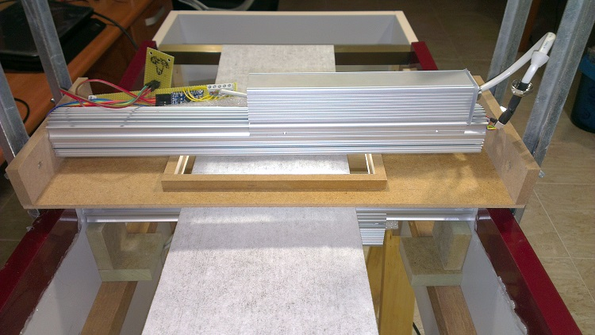
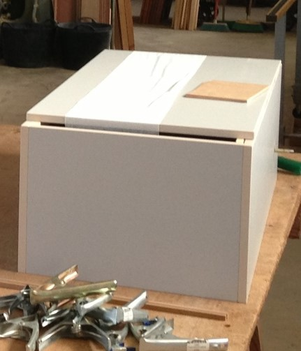
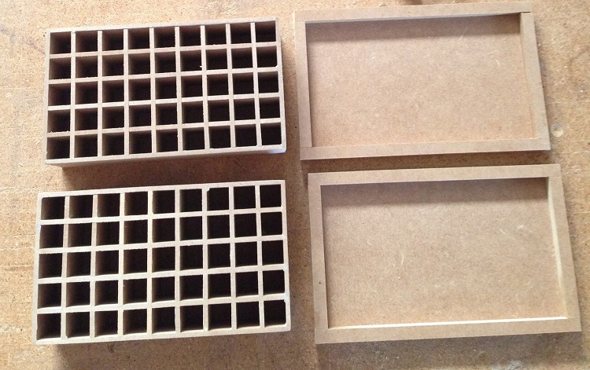
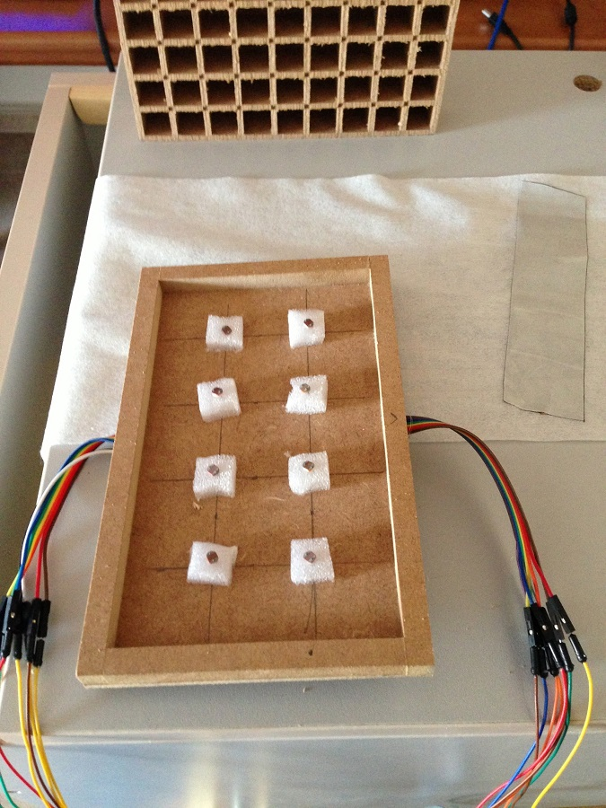
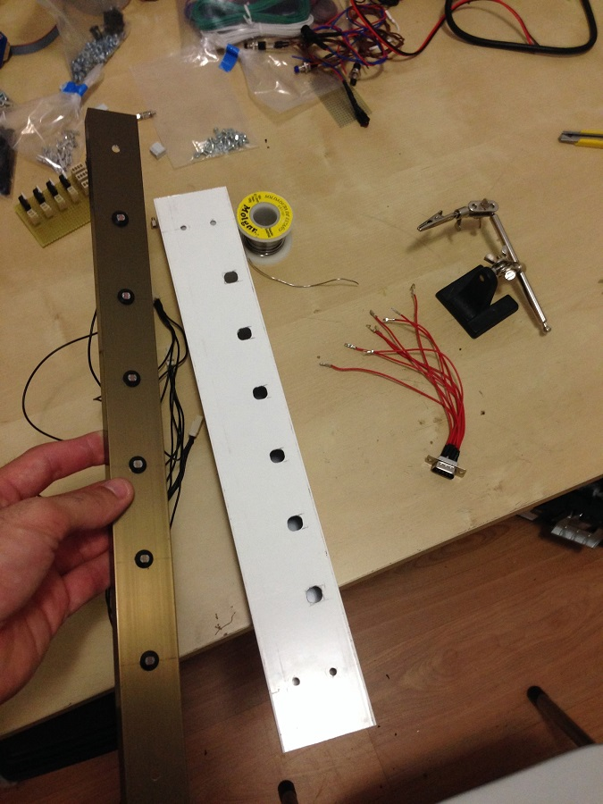
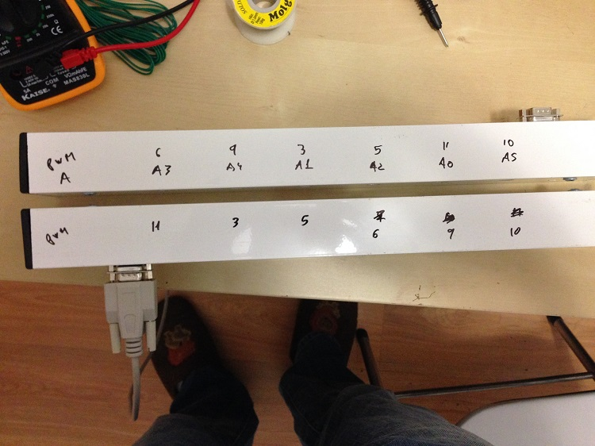
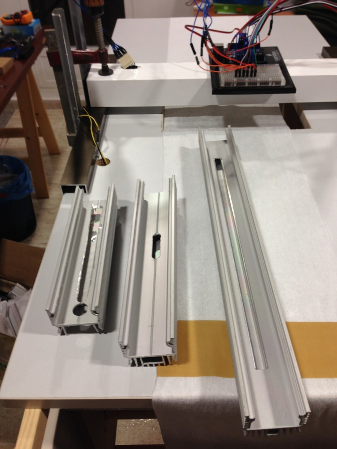
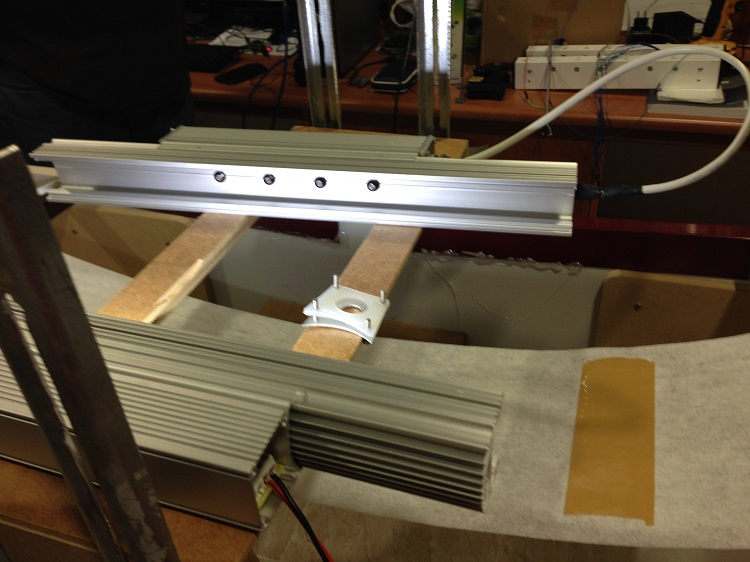
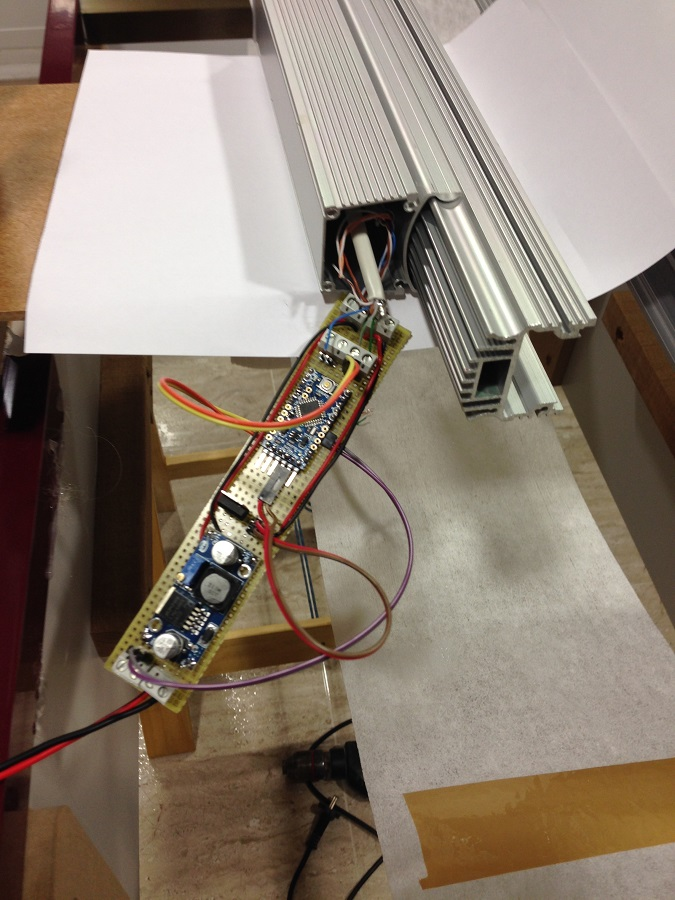
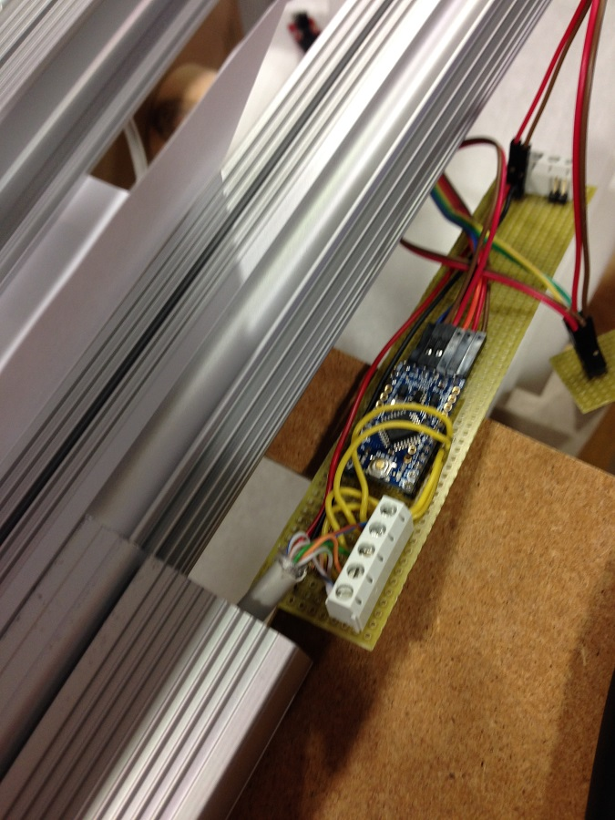

# Sistema de detección de la densidad del material usado para crear las toallitas húmedas con Arduino 1/2

## Introducción

Esta aventura comenzó cuando mi amigo Fran vino a buscarme para contarme la necesidad que había detectado en una empresa y quería que le echara una mano para llevarla a buen puerto.
Aunque al final el proyecto no se aplicó en la empresa, decidimos terminarlo, habíamos dedicado demasiado tiempo en él como para no hacerlo.

El proyecto consistía en crear un sistema de detección de la densidad de un material para detectar si este cumplía con la calidad esperada.
En caso de no cumplirla se debía de activar un relé.
La solución que se eligiera debía de aplicarse a 9 máquinas, ser capaz de estar funcionando las 24 horas del día y realizar las tareas a la velocidad de funcionamiento de la máquina.

El producto a analizar consistía en las bobinas de material usado para crear las toallitas húmedas.

Los casos que debían producir la activación del relé eran los siguientes:

- Densidad del producto inferior a la esperada.
- Densidad del producto superior a la esperada.
- Cintas de unión sobre el producto.
- Roturas y deformaciones del producto.

Para abordar el problema se decidió crear varias sesiones de brainstorming y de búsqueda de información para intentar encontrar las mejores soluciones a este problema.
Las ideas que se nos ocurrieron y que se estudiaron como posibles soluciones al problema, por orden, son las siguientes:

### Usar una cámara y estudiar el producto a partir de la información recibida.

La idea consistía en, a partir de la información obtenida de una cámara que estaba apuntando directamente al producto, usar un software de análisis de imágenes para detectar cada uno de los casos descritos antes.

La detección de cintas de unión, roturas y deformaciones consistía en usar librerías de visión artificial como [OpenCV](http://opencv.org/) o [SimpleCV](http://simplecv.org/) para analizar las imágenes recibidas, y a partir de ciertas reglas obtener si se cumplían estos casos.
La medición de la densidad del producto se debía de realizar analizando el color del producto al ser atravesado por una luz, con un color a estudiar.

Esta idea se descartó por el alto coste de hardware necesario para realizarlo, además de por la complejidad del software que se debía crear.

### Iluminar con una luz infrarroja y analizar la luz que atraviesa el producto.

La idea consistía en, iluminar con una luz infrarroja el producto y analizar la temperatura de la luz que atravesaba a éste.
Se estudió durante un tiempo la mejor forma de realizar las mediciones, pero se descubrió que cualquier cambio mínimo en la temperatura o en la intensidad de la luz de la sala en la que se encontraban las máquinas afectaba a las mediciones.

Se descartó porque la temperatura del producto puede cambiar por efectos externos y fuera de nuestro control, por tanto, complicaba sobremanera la medición de esta temperatura y obligaba a que el sistema detectara cambios de temperatura e intensidad de la luz en la sala y obligara a que el sistema se auto calibrara al detectar un mínimo cambio de uno de estos dos parámetros.

### Iluminar con una luz normal y analizar la cantidad de luz que atraviesa al producto.

Esta fue la idea que se llevó a la práctica.

La idea consistía en iluminar el producto por una cara y por la opuesta medir la cantidad de luz que lo traspasaba.

Después de estudiar qué color usar se decidió usar el blanco, éste era del que mejor información se podía obtener y el menos afectado por tener que traspasar el producto.

Mediante este sistema se podrían detectar los 4 casos que debía de cumplir el sistema:

- **Densidad del producto inferior a la esperada:** Se detectaría si la intensidad de luz era superior a un valor límite superior de intensidad de luz.
- **Densidad del producto superior a la esperada:** Se detectaría si la intensidad de luz era inferior a un valor límite inferior de intensidad de luz.
- **Cintas de unión sobre el producto:** Se detectaría si la intensidad de luz era nula o casi nula.
- **Roturas y deformaciones del producto:** Se detectaría si la intensidad de luz era la máxima posible o casi la máxima.

## Iteraciones/Fases por las que pasó el proyecto para llegar a la solución final.

Después de decidir cómo solucionar el problema, tocó decidir cómo llevarlo a la práctica.
La conclusión a la que se llegó fue la siguiente:

- Se debían de crear 2 barras que deberían de estar alineadas y el producto debería de pasar entre ambas.
- Una barra debería de iluminar el producto de forma uniforme y en la otra deberían de estar los LDR's (Light Dependent Resistor - fotorresistencia) para analizar la cantidad de luz que atraviesa a éste.
- Para controlar a ambas barras se usaría un Arduino. Se decidió usar el Arduino Pro Mini por su reducido tamaño.
- Para activar los relés y enviar los parámetros de configuración a los Arduinos que manejaban las barras se usaría otro Arduino. Se buscó por internet uno que pudiera usarse en un cuadro eléctrico o una carcasa para éste que cumpliera el mismo cometido y encontramos el [Industruino](https://Industruino.com/).
- La comunicación entre los Arduinos de las barras y el Industruino se realizaría por el bus I2C.

A partir de la solución que se decidió seguir se crearon 3 iteraciones. Cada una de las iteraciones generó un prototipo diferente y que nos acercó más a la solución final del problema.

Para poder realizar las pruebas se tuvo que echar mano del ingenio de mi hermano Raúl, quien nos construyó un banco para poder realizar las pruebas, éste fue modificándose según las necesidades en cada una de las pruebas que se realizaron.

### Iteración 1

En esta iteración se consideró crear 1 matriz de agujeros de 5x9 cuadros, en los que se introduciría un LED, pero teniendo en cuenta que los LEDs no podían estar colocados en agujeros consecutivos. De esta forma evitábamos que la luz de un LED afectara a un LDR que no fuera el suyo, además de que se intentaba evitar que la luz ambiente afectara a las medidas de luz que realizaban los LDR.

Primero se empezó con unos LED de bombillas, pero no se conseguía obtener la suficiente luz para poder realizar las mediciones de forma correcta y eficiente.
Continuamos con unos LEDs de faros de coche, pero el resultado era el mismo que con los anteriores LEDs.
Se continuó con la búsqueda de LEDs que fueran lo suficiente potentes para tomar las mediciones de forma correcta y se encontraron unos de 10w, estos hacían muchísima luz y se tuvo que regular su intensidad, la cantidad de luz que emitían a máxima potencia era tan grande que atravesaba el producto y las mediciones se aproximaban al máximo de luz que podían medir los LDRs.

Como última prueba se colocó una fila de LEDs de 10w y una fila de los LEDs de coche. Una vez realizada la prueba se llegó a la conclusión de que los LEDs a utilizar eran los de 10w, pero con su intensidad regulada. Estas barras conseguían cumplir todos los objetivos de detección, pero su tamaño era demasiado grande, por tanto, se descartaron.

### Iteración 2

En esta iteración se usaron barras rectangulares de aluminio, lo que permitió que las barras fueran más finas que las diseñadas con madera en la iteración anterior.

Para evitar que unos LEDs no afectaran a los otros y los LDR no estuvieran afectados por la luz de los otros LEDs fueron todos retirados un poco hacia el interior de la barra de LEDs, de esta forma se evitaba que la luz no directa recibida por los LDRs de la barra de LDRs afectara a las mediciones.

En esta iteración se tuvo el problema de que cada uno de los LEDs emitía una intensidad ligeramente diferente de luz y en algunos casos un color ligeramente diferente, esto complicaba bastante el código, ya que esto obligaba a que los LEDs y los LDRs tenían que calibrarse de forma independiente. Además de lo anterior se comprobó que las barras continuaban siendo un poco grandes para el hueco disponible.

### Iteración 3

El inicio de esta iteración comenzó con la búsqueda de unas barras más pequeñas y que permitieran reducir el tamaño total de las barras, de esta forma poder usarlas en la solución final. Como resultado de esta búsqueda se encontraron unos perfiles usados para iluminación de exteriores que nos permitían tener el tamaño deseado para las barras, además de una capacidad bastante grande de disipación de calor, los LEDs de 10w emitían una cantidad bastante grade de calor.
Durante el proceso de búsqueda de las barras anteriores y de casualidad se encontraron unos LED COB de 6w rectangulares de 170 x 15mm, lo que permitía iluminar todo el producto de forma uniforme, de esta forma se evitaba tener que esconder los LDR para que la luz de un LED diferente al asignado afectara a la medición de este. Esto permitió que se sustituyeron todos los LEDs anteriores un uno sólo COB.

El encontrar estos LEDs también permitió simplificar el proceso de calibrado, ya que a partir de entonces sólo se tenía que calibrar las medidas a tomar por cada uno de los LDRs y hacía innecesario el calibrado del LED, ya que sólo era necesario un LED COB. Además de esto simplificó el circuito necesario para el control de las barras, esto permitió que este circuito pudiera colocarse en las mismas barras y no tener que colocarlo en una caja exterior a estas.

Durante esta fase se tuvo un percance y por un error en la conexión de una alimentación, se conectó al Industruino en una entrada no regulada una tensión superior a la soportada y éste se quemó, quedando inutilizable, por tanto, se decidió crear un montaje similar al Industruino, pero con un Arduino UNO, una pantalla LCD de 16x2 y 3 botones, de esta forma se pudo acabar esta fase.
